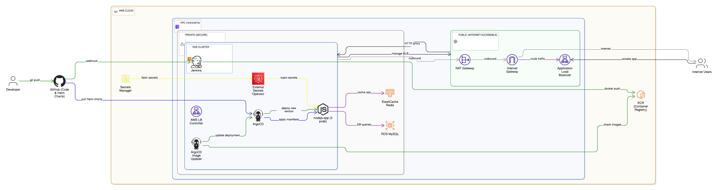

# AWS GitOps Pipeline - CI/CD with Jenkins, ArgoCD & Helm

Production-ready GitOps pipeline with ArgoCD Image Updater v1.0.0 (CR-based): Terraform → Jenkins → ECR → ArgoCD Image Updater → ArgoCD → EKS

**Result:** Push code → Auto-deploy in ~5 minutes

---

## 📖 Overview

This project demonstrates a complete, production-ready GitOps CI/CD pipeline on AWS. It automates the entire journey from code commit to production deployment using industry-standard tools and best practices.

**What This Project Does:**

- **Infrastructure as Code**: Provisions a complete AWS environment (VPC, EKS cluster, RDS database, Redis cache, ECR registry) using Terraform
- **Continuous Integration**: Jenkins automatically builds Docker images from your code and pushes them to Amazon ECR
- **Continuous Deployment**: ArgoCD monitors your Git repository and automatically deploys changes to Kubernetes
- **Automated Image Updates**: ArgoCD Image Updater watches ECR for new images and triggers deployments without manual intervention
- **Secrets Management**: External Secrets Operator securely injects AWS Secrets Manager credentials into your applications
- **Load Balancing**: AWS Load Balancer Controller automatically provisions Application Load Balancers for ingress traffic
- **Security**: Uses IAM Roles for Service Accounts (IRSA) for secure, credential-free AWS access from Kubernetes

**The Complete Flow:**

1. Developer pushes code to GitHub
2. Jenkins detects the change, builds a Docker image, and pushes it to ECR with a `build-X` tag
3. ArgoCD Image Updater checks ECR every 2 minutes, detects the new image
4. Image Updater updates the ArgoCD Application spec with the new image tag
5. ArgoCD syncs the change and deploys the new version to EKS
6. AWS Load Balancer Controller exposes the application via an Application Load Balancer
7. Application runs with secrets from AWS Secrets Manager, connected to RDS and Redis

**Time from code push to production: ~5 minutes** ⚡

This is a fully functional reference implementation that you can deploy to any AWS account and adapt for your own applications.

## Architecture Diagram



---

## ⚠️ Important: Dynamic Configuration

This project is designed to work with **any AWS account**. All AWS account IDs and ECR URLs are configured dynamically during setup.

**No hardcoded AWS account IDs!** Follow the setup instructions below to configure everything automatically.

---

## 📋 Prerequisites

- AWS CLI configured
- kubectl, Helm 3, Terraform installed
- Fork this repository to your GitHub account

---

## 🚀 Complete Deployment Guide

### Step 1: Deploy Infrastructure (15 min)

```bash
cd terraform
terraform init
terraform apply -var="db_password=YourSecurePassword123!" -auto-approve
aws eks update-kubeconfig --region us-east-1 --name gitops-eks-cluster
kubectl get nodes
```

### Step 2: Install Jenkins (3 min)

```bash
helm repo add jenkins https://charts.jenkins.io
helm repo update
helm install jenkins jenkins/jenkins --namespace jenkins --create-namespace --values terraform/jenkins-helm-values.yaml
```

**Annotate Jenkins service account with IAM role:**

**Linux/Mac:**
```bash
ROLE_ARN=$(cd terraform && terraform output -raw jenkins_role_arn)
kubectl annotate serviceaccount jenkins -n jenkins eks.amazonaws.com/role-arn=$ROLE_ARN --overwrite
kubectl delete pod jenkins-0 -n jenkins
```

**Windows PowerShell:**
```powershell
Push-Location terraform; $ROLE_ARN = terraform output -raw jenkins_role_arn; Pop-Location
kubectl annotate serviceaccount jenkins -n jenkins eks.amazonaws.com/role-arn=$ROLE_ARN --overwrite
kubectl delete pod jenkins-0 -n jenkins
```

**Access Jenkins:**

```bash
# Get admin password
kubectl exec -n jenkins -it svc/jenkins -c jenkins -- /bin/cat /run/secrets/additional/chart-admin-password

# Port forward (run in separate terminal)
kubectl port-forward svc/jenkins 8080:8080 -n jenkins
```

Open http://localhost:8080 and login with admin / password-from-above

**Create Jenkins Pipeline:**
1. New Item → `nodejs-app-pipeline` → Pipeline
2. SCM: Git
3. Repository URL: `https://github.com/YOUR_USERNAME/YOUR_FORKED_REPO.git`
4. Branch: `*/main`
5. Script Path: `nodejs-app/Jenkinsfile`
6. Save → Build Now

### Step 3: Install ArgoCD (3 min)

```bash
helm repo add argo https://argoproj.github.io/argo-helm
helm repo update
helm install argocd argo/argo-cd --namespace argocd --create-namespace --version 7.7.12
kubectl wait --for=condition=ready pod -l app.kubernetes.io/name=argocd-server -n argocd --timeout=300s
```

**Get ArgoCD admin password:**

**Linux/Mac:**
```bash
kubectl -n argocd get secret argocd-initial-admin-secret -o jsonpath="{.data.password}" | base64 -d
```

**Windows PowerShell:**
```powershell
kubectl -n argocd get secret argocd-initial-admin-secret -o jsonpath="{.data.password}" | ForEach-Object { [System.Text.Encoding]::UTF8.GetString([System.Convert]::FromBase64String($_)) }
```

**Port forward (run in separate terminal):**

```bash
kubectl port-forward svc/argocd-server -n argocd 8081:443
```

Open https://localhost:8081 (admin / password-from-above)

### Step 4: Install ArgoCD Image Updater v1.0.0 (2 min)

**Install Image Updater with CR-based configuration:**

```bash
helm install argocd-image-updater argo/argocd-image-updater --namespace argocd --version 1.0.0 -f k8s/argocd/image-updater-values.yaml
```

**Annotate service account with IAM role:**

**Linux/Mac:**
```bash
ROLE_ARN=$(cd terraform && terraform output -raw argocd_image_updater_role_arn)
kubectl annotate serviceaccount argocd-image-updater -n argocd eks.amazonaws.com/role-arn=$ROLE_ARN --overwrite
kubectl delete pod -n argocd -l app.kubernetes.io/name=argocd-image-updater
```

**Windows PowerShell:**
```powershell
Push-Location terraform; $ROLE_ARN = terraform output -raw argocd_image_updater_role_arn; Pop-Location
kubectl annotate serviceaccount argocd-image-updater -n argocd eks.amazonaws.com/role-arn=$ROLE_ARN --overwrite
kubectl delete pod -n argocd -l app.kubernetes.io/name=argocd-image-updater
```

**Apply ImageUpdater Custom Resource:**

```bash
kubectl apply -f k8s/argocd/imageupdater-cr.yaml
```

### Step 5: Install External Secrets Operator (2 min)

```bash
helm repo add external-secrets https://charts.external-secrets.io
helm repo update
helm install external-secrets external-secrets/external-secrets --namespace external-secrets-system --create-namespace
kubectl wait --for=condition=ready pod -l app.kubernetes.io/name=external-secrets -n external-secrets-system --timeout=120s
```

### Step 6: Install AWS Load Balancer Controller (3 min)

```bash
helm repo add eks https://aws.github.io/eks-charts
helm repo update
helm install aws-load-balancer-controller eks/aws-load-balancer-controller -n kube-system --set clusterName=gitops-eks-cluster --set serviceAccount.create=true --set serviceAccount.name=aws-load-balancer-controller
```

**Annotate service account with IAM role:**

**Linux/Mac:**
```bash
ROLE_ARN=$(cd terraform && terraform output -raw aws_lb_controller_role_arn)
kubectl annotate serviceaccount aws-load-balancer-controller -n kube-system eks.amazonaws.com/role-arn=$ROLE_ARN --overwrite
kubectl rollout restart deployment aws-load-balancer-controller -n kube-system
```

**Windows PowerShell:**
```powershell
Push-Location terraform; $ROLE_ARN = terraform output -raw aws_lb_controller_role_arn; Pop-Location
kubectl annotate serviceaccount aws-load-balancer-controller -n kube-system eks.amazonaws.com/role-arn=$ROLE_ARN --overwrite
kubectl rollout restart deployment aws-load-balancer-controller -n kube-system
```

### Step 7: Deploy Application (3 min)

**Apply ArgoCD Application:**

```bash
kubectl apply -f k8s/argocd/application-no-annotations.yaml
```

**Wait for namespace and service account to be created (~30 seconds):**

**Linux/Mac:**
```bash
sleep 30
```

**Windows PowerShell:**
```powershell
Start-Sleep -Seconds 30
```

**Annotate nodejs-app service account with IAM role:**

**Linux/Mac:**
```bash
ROLE_ARN=$(cd terraform && terraform output -raw nodejs_app_secrets_role_arn)
kubectl annotate serviceaccount nodejs-app-sa -n nodejs-app eks.amazonaws.com/role-arn=$ROLE_ARN --overwrite
```

**Windows PowerShell:**
```powershell
Push-Location terraform; $ROLE_ARN = terraform output -raw nodejs_app_secrets_role_arn; Pop-Location
kubectl annotate serviceaccount nodejs-app-sa -n nodejs-app eks.amazonaws.com/role-arn=$ROLE_ARN --overwrite
```

**Restart External Secrets Operator to pick up the annotation:**

```bash
kubectl rollout restart deployment -n external-secrets-system
```

**Wait for secrets to sync and pods to start:**

**Linux/Mac:**
```bash
sleep 30
kubectl get pods -n nodejs-app
kubectl get externalsecret -n nodejs-app
```

**Windows PowerShell:**
```powershell
Start-Sleep -Seconds 30
kubectl get pods -n nodejs-app
kubectl get externalsecret -n nodejs-app
```

**Verify deployment:**

```bash
kubectl get application nodejs-app -n argocd  # Should show: Synced, Healthy
kubectl get pods -n nodejs-app                 # Should show: Running
```

### Step 8: Access the Application

**Wait for ALB creation (2-3 min):**

```bash
kubectl get ingress -n nodejs-app -w  # Watch for ADDRESS field
```

Press Ctrl+C when ADDRESS appears.

**Get ALB URL and test:**

**Linux/Mac:**
```bash
ALB_URL=$(kubectl get ingress nodejs-app -n nodejs-app -o jsonpath='{.status.loadBalancer.ingress[0].hostname}')
echo "Application URL: http://$ALB_URL"
curl "http://$ALB_URL/health"
```

**Windows PowerShell:**
```powershell
$ALB_URL = kubectl get ingress nodejs-app -n nodejs-app -o jsonpath='{.status.loadBalancer.ingress[0].hostname}'
Write-Host "Application URL: http://$ALB_URL"
curl "http://$ALB_URL/health"
```

Open http://$ALB_URL in your browser to access the web UI.

---

## 🧪 Test the GitOps Pipeline

### Test Image Updater (CR-based v1.0.0)

The Image Updater uses a Custom Resource (CR) instead of annotations:

```bash
# View the ImageUpdater CR
kubectl get imageupdater -n argocd
kubectl describe imageupdater nodejs-app-updater -n argocd

# Watch Image Updater logs
kubectl logs -n argocd -l app.kubernetes.io/name=argocd-image-updater -f
```

**How it works:**
- Image Updater checks ECR every 2 minutes for new images
- Uses `alphabetical` strategy to pick the highest build number
- Ignores tags: `latest`, `v*`
- Automatically updates the Application spec when a new `build-X` image is found
- ArgoCD syncs the new image automatically

### Test End-to-End Pipeline

1. Make a code change in `nodejs-app/src/routes/health.js`
2. Commit and push:
   ```powershell
   git add nodejs-app/src/routes/health.js
   git commit -m "Test pipeline"
   git push
   ```
3. Jenkins builds and pushes image with tag `build-X`
4. Within 2 minutes, Image Updater detects and updates the Application
5. ArgoCD syncs the new image
6. Check deployment:
   ```powershell
   kubectl get application nodejs-app -n argocd
   kubectl describe deployment nodejs-app -n nodejs-app | Select-String "Image:"
   ```

---

## 🔍 Monitoring & Debugging

### Check Image Updater Status

```powershell
# View ImageUpdater CR
kubectl get imageupdater nodejs-app-updater -n argocd -o yaml

# Check logs
kubectl logs -n argocd -l app.kubernetes.io/name=argocd-image-updater --tail=50

# Verify ECR authentication
kubectl logs -n argocd -l app.kubernetes.io/name=argocd-image-updater | Select-String "ecr-login"
```

### Check Application Status

```powershell
# Application sync status
kubectl get application nodejs-app -n argocd

# Current image version
kubectl describe deployment nodejs-app -n nodejs-app | Select-String "Image:"

# Pod status
kubectl get pods -n nodejs-app

# External Secrets status
kubectl get externalsecret -n nodejs-app
kubectl get secretstore -n nodejs-app
```

### Check Load Balancer

```powershell
# Ingress status
kubectl get ingress -n nodejs-app

# ALB Controller logs
kubectl logs -n kube-system -l app.kubernetes.io/name=aws-load-balancer-controller --tail=50
```

---

## 🐛 Troubleshooting

### Jenkins ECR 403 Error

```powershell
$ROLE_ARN = (cd terraform; terraform output -raw jenkins_role_arn)
kubectl annotate serviceaccount jenkins -n jenkins eks.amazonaws.com/role-arn=$ROLE_ARN --overwrite
kubectl delete pod jenkins-0 -n jenkins
```

### Image Updater Not Detecting Images

```powershell
# Check if Image Updater pod is running
kubectl get pods -n argocd -l app.kubernetes.io/name=argocd-image-updater

# Check IAM role annotation
kubectl get serviceaccount argocd-image-updater -n argocd -o yaml | Select-String "role-arn"

# Re-annotate if needed
$ROLE_ARN = (cd terraform; terraform output -raw argocd_image_updater_role_arn)
kubectl annotate serviceaccount argocd-image-updater -n argocd eks.amazonaws.com/role-arn=$ROLE_ARN --overwrite
kubectl delete pod -n argocd -l app.kubernetes.io/name=argocd-image-updater
```

### External Secrets Not Syncing

```powershell
# Check SecretStore status
kubectl get secretstore -n nodejs-app
kubectl describe secretstore aws-secrets-manager -n nodejs-app

# Check service account annotation
kubectl get serviceaccount nodejs-app-sa -n nodejs-app -o yaml | Select-String "role-arn"

# Re-annotate if needed
$ROLE_ARN = (cd terraform; terraform output -raw nodejs_app_secrets_role_arn)
kubectl annotate serviceaccount nodejs-app-sa -n nodejs-app eks.amazonaws.com/role-arn=$ROLE_ARN --overwrite
kubectl rollout restart deployment -n external-secrets-system
kubectl delete pod --all -n nodejs-app
```

### Application Stuck in Progressing/Degraded

```powershell
# Check application details
kubectl describe application nodejs-app -n argocd

# Check pod events
kubectl get events -n nodejs-app --sort-by='.lastTimestamp'

# Force sync
kubectl patch application nodejs-app -n argocd --type merge -p '{"operation":{"initiatedBy":{"username":"admin"},"sync":{"syncStrategy":{"hook":{}}}}}'
```

### Load Balancer Not Creating

```powershell
# Check ALB Controller status
kubectl get pods -n kube-system -l app.kubernetes.io/name=aws-load-balancer-controller

# Check IAM role
kubectl get serviceaccount aws-load-balancer-controller -n kube-system -o yaml | Select-String "role-arn"

# Re-annotate if needed
$ROLE_ARN = (cd terraform; terraform output -raw aws_lb_controller_role_arn)
kubectl annotate serviceaccount aws-load-balancer-controller -n kube-system eks.amazonaws.com/role-arn=$ROLE_ARN --overwrite
kubectl rollout restart deployment aws-load-balancer-controller -n kube-system
```

---

## 🗑️ Cleanup

**⚠️ Follow this order to avoid stuck VPC deletion!**

### Step 1: Delete Application and Wait for ALB Cleanup

**Linux/Mac:**
```bash
kubectl delete application nodejs-app -n argocd
sleep 60
```

**Windows PowerShell:**
```powershell
kubectl delete application nodejs-app -n argocd
Start-Sleep -Seconds 60
```

### Step 2: Force Delete Ingress if Stuck

```bash
kubectl patch ingress nodejs-app -n nodejs-app -p '{"metadata":{"finalizers":[]}}' --type=merge
kubectl delete ingress nodejs-app -n nodejs-app --force --grace-period=0
```

### Step 3: Delete Load Balancers and Security Groups

**Linux/Mac:**
```bash
# Get VPC ID
VPC_ID=$(cd terraform && terraform output -raw vpc_id)

# Delete ALBs
ALB_ARNS=$(aws elbv2 describe-load-balancers --region us-east-1 --query 'LoadBalancers[?contains(LoadBalancerName, `k8s-`)].LoadBalancerArn' --output text)
for arn in $ALB_ARNS; do aws elbv2 delete-load-balancer --load-balancer-arn $arn; done

# Delete Target Groups
TG_ARNS=$(aws elbv2 describe-target-groups --region us-east-1 --query 'TargetGroups[?contains(TargetGroupName, `k8s-`)].TargetGroupArn' --output text)
for arn in $TG_ARNS; do aws elbv2 delete-target-group --target-group-arn $arn; done

sleep 30

# Delete Security Groups created by LB Controller
SG_IDS=$(aws ec2 describe-security-groups --region us-east-1 --filters "Name=vpc-id,Values=$VPC_ID" --query 'SecurityGroups[?contains(GroupName, `k8s-`)].GroupId' --output text)
for sg in $SG_IDS; do aws ec2 delete-security-group --group-id $sg 2>&1 || true; done
```

**Windows PowerShell:**
```powershell
# Get VPC ID
$VPC_ID = (cd terraform; terraform output -raw vpc_id)

# Delete ALBs
$ALB_ARNS = aws elbv2 describe-load-balancers --region us-east-1 --query 'LoadBalancers[?contains(LoadBalancerName, `k8s-`)].LoadBalancerArn' --output text
if ($ALB_ARNS) { $ALB_ARNS -split "`t" | ForEach-Object { aws elbv2 delete-load-balancer --load-balancer-arn $_ } }

# Delete Target Groups
$TG_ARNS = aws elbv2 describe-target-groups --region us-east-1 --query 'TargetGroups[?contains(TargetGroupName, `k8s-`)].TargetGroupArn' --output text
if ($TG_ARNS) { $TG_ARNS -split "`t" | ForEach-Object { aws elbv2 delete-target-group --target-group-arn $_ } }

Start-Sleep -Seconds 30

# Delete Security Groups created by LB Controller
$SG_IDS = aws ec2 describe-security-groups --region us-east-1 --filters "Name=vpc-id,Values=$VPC_ID" --query 'SecurityGroups[?contains(GroupName, `k8s-`)].GroupId' --output text
if ($SG_IDS) { $SG_IDS -split "`t" | ForEach-Object { aws ec2 delete-security-group --group-id $_ 2>&1 } }
```

### Step 4: Uninstall Helm Charts

```bash
helm uninstall aws-load-balancer-controller -n kube-system
helm uninstall argocd-image-updater -n argocd
helm uninstall argocd -n argocd
helm uninstall external-secrets -n external-secrets-system
helm uninstall jenkins -n jenkins
```

### Step 5: Destroy Infrastructure

```bash
cd terraform
terraform destroy -var="db_password=YourSecurePassword123!" -auto-approve
```

**Why this order?** AWS LB Controller creates ALB, target groups, and security groups outside Terraform. Deleting them first prevents VPC from hanging during destruction.

---

## 📁 Project Structure

```
├── terraform/
│   ├── modules/
│   │   ├── vpc/           # VPC, subnets, NAT gateway
│   │   ├── eks/           # EKS cluster, node groups, OIDC
│   │   ├── rds/           # MySQL database
│   │   ├── elasticache/   # Redis cache
│   │   ├── ecr/           # Container registry
│   │   └── iam/           # IAM roles for IRSA (NEW!)
│   ├── main.tf            # Module orchestration (cleaned up!)
│   ├── variables.tf
│   └── outputs.tf
├── k8s/
│   ├── helm-chart/        # Helm chart for nodejs-app
│   └── argocd/
│       ├── application-no-annotations.yaml  # ArgoCD Application
│       ├── imageupdater-cr.yaml            # ImageUpdater CR (v1.0.0)
│       └── image-updater-values.yaml       # Helm values for Image Updater
└── nodejs-app/            # Node.js app (Express + MySQL + Redis)
```

---

## 🔄 Pipeline Flow

```
Push → Jenkins → ECR → Image Updater CR → ArgoCD → EKS → Running!
```

---

## 📝 Key Features

### ArgoCD Image Updater v1.0.0 (CR-based)

This project uses the **new CR-based approach** instead of annotations:

**Configuration:**
- `k8s/argocd/imageupdater-cr.yaml` - ImageUpdater Custom Resource
- `k8s/argocd/image-updater-values.yaml` - Helm values with IRSA and ECR auth

**How it works:**
1. ImageUpdater CR watches the `nodejs-app` Application
2. Checks ECR every 2 minutes for new images
3. Uses `alphabetical` strategy (lexical sorting)
4. Only considers tags matching `build-[0-9]+` pattern
5. Automatically updates Application spec with new image tag
6. ArgoCD syncs the changes

**Benefits over annotation-based:**
- Centralized configuration
- Better for managing multiple applications
- Easier to version control
- More flexible filtering options

### IAM Module

All IAM roles for IRSA are now organized in `terraform/modules/iam/`:
- Jenkins ECR access
- ArgoCD Image Updater ECR access
- External Secrets Operator
- AWS Load Balancer Controller
- nodejs-app secrets access
- EBS CSI Driver

This keeps `main.tf` clean and maintainable.

---

## 🔗 Quick Commands

```powershell
# Check overall status
kubectl get pods --all-namespaces
kubectl get application -n argocd
kubectl get ingress -n nodejs-app

# View Image Updater logs
kubectl logs -n argocd -l app.kubernetes.io/name=argocd-image-updater --tail=20

# View application logs
kubectl logs -n nodejs-app -l app=nodejs-app --tail=20

# Current image version
kubectl describe deployment nodejs-app -n nodejs-app | Select-String "Image:"

# Check ImageUpdater CR
kubectl get imageupdater -n argocd
kubectl describe imageupdater nodejs-app-updater -n argocd
```

---

## 💰 Cost Estimate

**Monthly:** ~$213 | **After Destroy:** $0

- EKS: $73
- EC2 (nodes): $60
- RDS: $15
- Redis: $12
- ALB: $16
- NAT Gateway: $32
- Data Transfer: $5

---

## 📚 Documentation

### Image Updater CR Schema

The ImageUpdater CR follows this structure:

```yaml
apiVersion: argocd-image-updater.argoproj.io/v1alpha1
kind: ImageUpdater
metadata:
  name: nodejs-app-updater
  namespace: argocd
spec:
  namespace: argocd  # Where to look for Applications
  
  commonUpdateSettings:
    updateStrategy: alphabetical  # or semver, latest, digest
    ignoreTags:  # Tags to ignore
      - "latest"
      - "v*"
  
  writeBackConfig:
    method: argocd  # or git for GitOps write-back
  
  applicationRefs:
    - namePattern: "nodejs-app"  # Application name pattern
      images:
        - alias: nodejs-app
          imageName: <ECR_URL>:latest
          manifestTargets:
            helm:
              name: image.repository
              tag: image.tag
```

### IRSA (IAM Roles for Service Accounts)

All service accounts use IRSA for AWS authentication:

| Service Account | Namespace | IAM Role | Purpose |
|----------------|-----------|----------|---------|
| jenkins | jenkins | jenkins-role | Push images to ECR |
| argocd-image-updater | argocd | argocd-image-updater-role | Read images from ECR |
| nodejs-app-sa | nodejs-app | nodejs-app-secrets-role | Access Secrets Manager |
| aws-load-balancer-controller | kube-system | aws-lb-controller-role | Manage ALBs |

---

---

## 📊 Results

### Terraform Resources

Infrastructure provisioned with Terraform:

.png)
.png)
.png)
.png)
.png)
.png)
.png)
.png)
.png)

### Installing and Configuring Jenkins and Running the Pipeline

Jenkins setup and pipeline execution:

.png)
.png)
.png)
.png)
.png)

### Installing ArgoCD, Argo Image Updater, External Secrets, AWS Load Balancer Controller and Deploying the App

Complete deployment of all components:

.png)
.png)
.png)
.png)
.png)
.png)
.png)
.png)
.png)

### Testing the Argo Image Updater

Image Updater in action:

.png)
.png)
.png)
.png)
.png)

---

**Last Updated:** November 16, 2025  
**Status:** ✅ Complete GitOps pipeline with Image Updater v1.0.0 (CR-based) working
